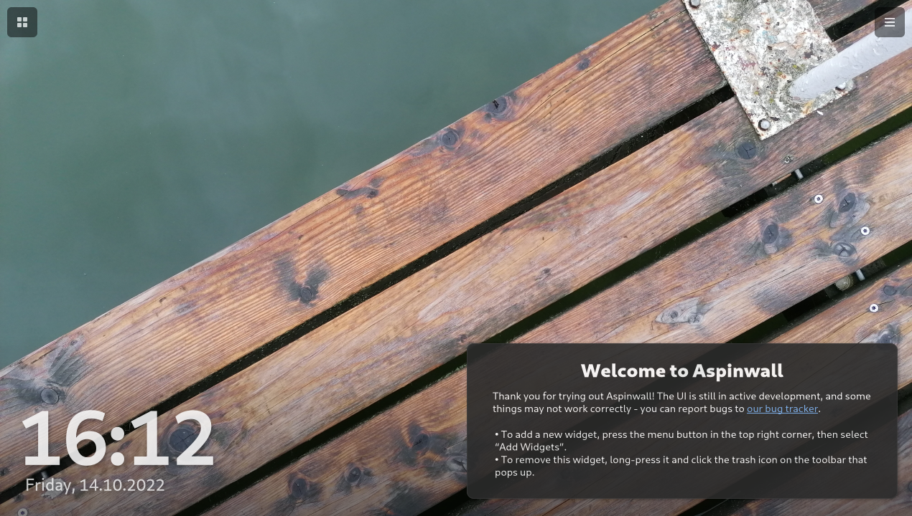

# Aspinwall <a href="https://hosted.weblate.org/engage/aspinwall-ui/"></a>

Linux tablet shell that turns your device into a smart hub when not in use



## About

Aspinwall is a Linux interface for tablets and touchscreen devices. It offers:

- A clean, focused launcher with a widget view - reminiscent of smart hub devices
- Some level of convergence - the shell works on both vertical (portrait) and horizontal (landscape) displays
- A widget API for creating your own widgets
- (TODO) Multitasking features, such as a dedicated app list and easy window control
- (TODO) Integration with voice assistants (see our Mycroft GUI, [Lapel](https://github.com/aspinwall-ui/lapel))

## Installing

The project can be built and installed with Meson:

```shell
$ meson . build
$ meson compile -C build
$ sudo meson install -C build
```

For development purposes, the launcher can be started using the provided `./run-launcher` script.

You can also preview the entire shell with ./run-xnest (this assumes you have Xnest installed). Note that compositing does not work in Xnest, so some portions of the shell will not display correctly; the best way to preview the shell is by launching it as a proper session.

Before you can use the `./run-*` scripts, you will need to install Meson.

## Requirements

### Runtime

- GTK 4.0 (>4.5.0 required for libadwaita 1.0.0)
- libadwaita >= 1.0.0
- GLib
- Python >= 3.6
- PyGObject

#### Shell

- dbus-python
- herbstluftwm (and its Python bindings)
- picom
- psutil
- pulsectl
- python-ewmh
- python-xlib

### Build

These are also needed if you're planning to use the provided run scripts.

- meson
- glib2-dev or equivalent (needed for `glib-compile-schemas`)
- desktop-file-utils (needed for `update-desktop-database`)

## Contributing

The project is still in early development; we'd recommend holding off from contributing for the next month or so, until the basic features are fully implemented.

However, we are accepting initial translations; we use [Hosted Weblate](https://hosted.weblate.org/projects/aspinwall-ui/) to manage translations. Built-in widget translations are split to their own sub-components; the main shell and launcher translation can be found in the [Aspinwall Shell](https://hosted.weblate.org/projects/aspinwall-ui/aspinwall-shell/) component.

The current TODO list for the shell can be found [here](https://github.com/aspinwall-ui/aspinwall/issues/1).

See also: [Contributing to Aspinwall](docs/contributing/contributing.md)

## FAQ

### **Q:** Where does the name come from?

**A**: The name *Aspinwall* is a reference to the location of [Henryk Sienkiewicz](https://en.wikipedia.org/wiki/Henryk_Sienkiewicz)'s novel, *The Lighthouse Keeper*. There's no real reason for why it was picked; it was chosen primarily for aesthetic purposes.

### **Q:** Does Aspinwall run on Android?

**A:** No. Aspinwall is a Linux shell, and there are no plans to release an Android port of any of the shell's elements, unless a GTK4 Android port arises at some point.

With that being said, we encourage using Aspinwall on any old Android tablets you may have; give [postmarketOS](https://postmarketos.org) a try. Aspinwall is being developed with the limitations of downstream kernels in mind, so it should work relatively well on older devices not running a (close to) mainline kernel.

*Developer's note: Aspinwall is planned to be packaged for postmarketOS, however it is not currently available as the project is still in very early development. Also, we are in no way affiliated with postmarketOS.*

### **Q:** Does Aspinwall run on Windows/Mac/any other platform supported by GTK4?

**A:** Aspinwall uses a handful of Linux-specific APIs and packages for some of its features (NetworkManager for WiFi control, etc.), and it's not meant to be run on anything other than Linux. While the launcher may work, some widgets may not. The shell will also completely lack functionality.

### **Q:** Is Aspinwall a GNOME project?

**A:** Aspinwall attempts to follow some design philosophies from Phosh and GNOME, but is not affiliated with either of the two.
